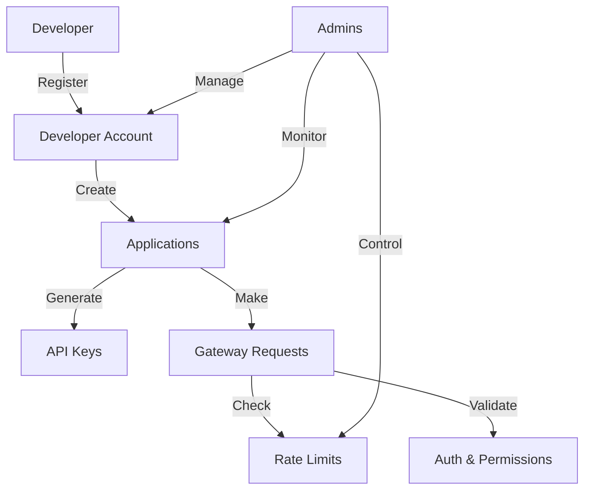

# ZenithNode Developer Gateway

A Clarity-based solution that provides developers with a simplified interface to interact with the Stacks blockchain, offering essential services like request validation, rate limiting, and standardized response formatting.

## Overview

ZenithNode Developer Gateway acts as an intermediary layer that abstracts away complex blockchain interactions, enabling developers to focus on building their applications rather than managing low-level blockchain operations. The gateway provides:

- Developer registration and management
- Application registration with API key generation
- Rate limiting and usage tracking
- Standardized request handling
- Administrative controls and monitoring

## Architecture

The ZenithNode Gateway is built using a single smart contract that manages all core functionality. Here's how the components work together:



### Core Components:
- Developer Management
- Application Registry
- Rate Limiting System
- Request Gateway
- Administrative Controls

## Contract Documentation

### Key Data Structures

1. **Developers Map**
   - Stores developer information
   - Tracks registration time, status, and rate limits

2. **Developer Apps Map**
   - Maps developers to their applications
   - Stores app details and API keys

3. **Usage Metrics Map**
   - Tracks request counts and timing
   - Enforces rate limiting

### Access Control

- Contract Owner: Full administrative access
- Admins: Can manage developers and applications
- Developers: Can manage their own apps and make requests
- Public: Can view public information

## Getting Started

### Prerequisites
- Clarinet
- Stacks Wallet
- Node.js (for testing)

### Installation

1. Clone the repository
2. Install dependencies:
```bash
clarinet install
```

### Basic Usage

1. Register as a developer:
```clarity
(contract-call? .zenith-node register-developer (some "Dev Name") (some "dev@example.com"))
```

2. Register an application:
```clarity
(contract-call? .zenith-node register-application "my-app" "My App" (some u"Description") none)
```

3. Make a gateway request:
```clarity
(contract-call? .zenith-node gateway-request "my-app" "api-key" "request-type" (list "param1" "param2"))
```

## Function Reference

### Developer Management

```clarity
(register-developer (name (optional (string-ascii 100))) (email (optional (string-ascii 100))))
(update-profile (name (optional (string-ascii 100))) (email (optional (string-ascii 100))))
```

### Application Management

```clarity
(register-application (app-id (string-ascii 50)) (name (string-ascii 100)) (description (optional (string-utf8 500))) (domain (optional (string-ascii 100))))
(update-application (app-id (string-ascii 50)) (name (string-ascii 100)) (description (optional (string-utf8 500))) (domain (optional (string-ascii 100))))
(delete-application (app-id (string-ascii 50)))
(regenerate-api-key (app-id (string-ascii 50)))
```

### Gateway Operations

```clarity
(gateway-request (app-id (string-ascii 50)) (api-key (string-ascii 64)) (request-type (string-ascii 50)) (params (list 10 (string-utf8 200))))
```

### Administrative Functions

```clarity
(add-admin (address principal) (role (string-ascii 20)))
(update-developer-status (developer principal) (status (string-ascii 20)) (rate-limit uint))
(update-application-status (developer principal) (app-id (string-ascii 50)) (status (string-ascii 20)))
```

## Development

### Testing

Run the test suite:
```bash
clarinet test
```

### Local Development

1. Start Clarinet console:
```bash
clarinet console
```

2. Deploy contracts:
```bash
clarinet deploy
```

## Security Considerations

### Rate Limiting
- Default limit: 1,000 requests per day
- Premium limit: 10,000 requests per day
- Rate limits are enforced per developer

### API Key Security
- API keys are bound to specific applications
- Keys can be regenerated if compromised
- Keys must be kept secure and not shared

### Known Limitations
- Maximum 5 applications per developer
- Request parameters limited to 10 items
- Daily rate limiting is approximated using block height

### Best Practices
- Always validate API keys before making requests
- Monitor usage metrics to avoid hitting rate limits
- Regularly update application details and rotate API keys
- Use secure channels to transmit API keys